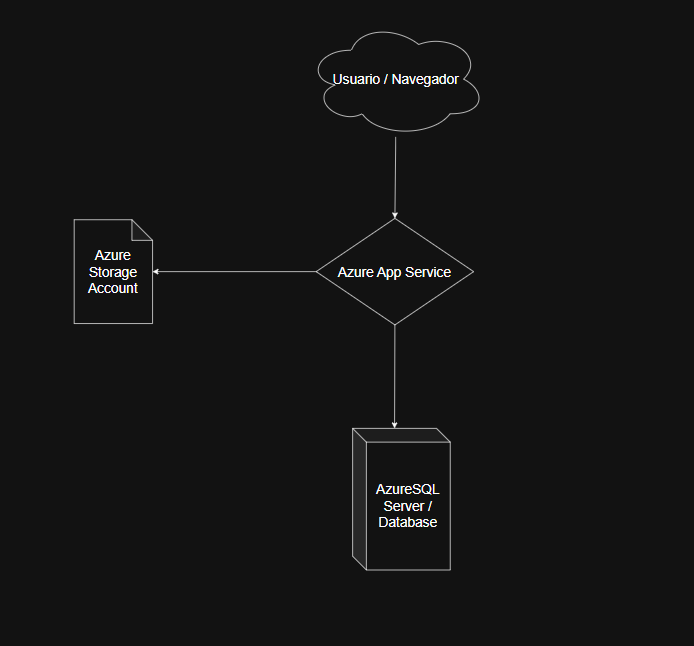
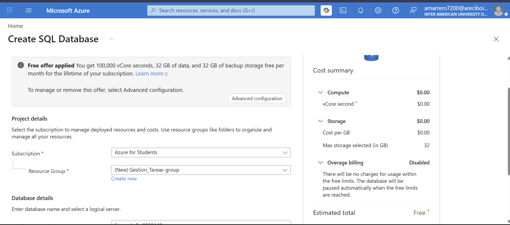
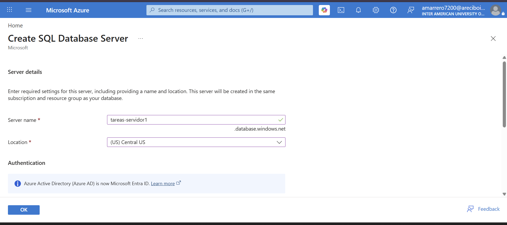
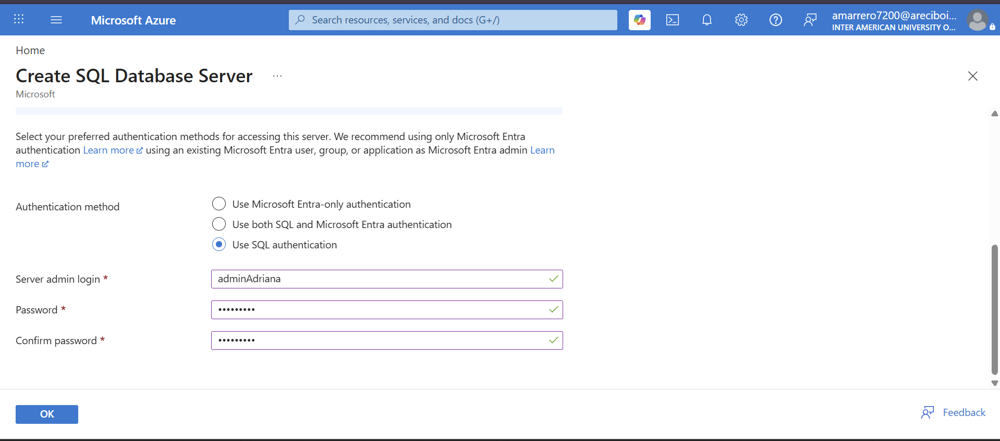
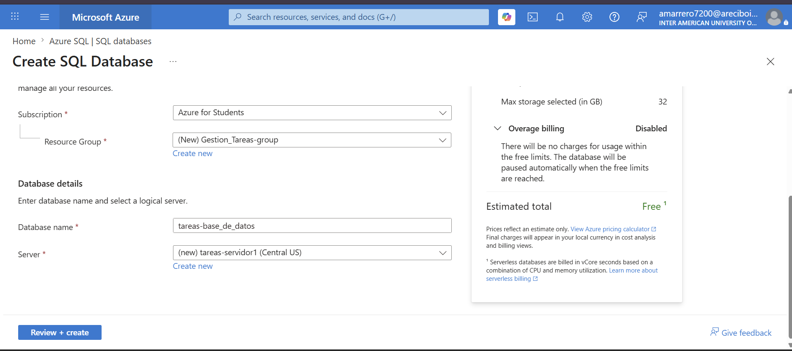
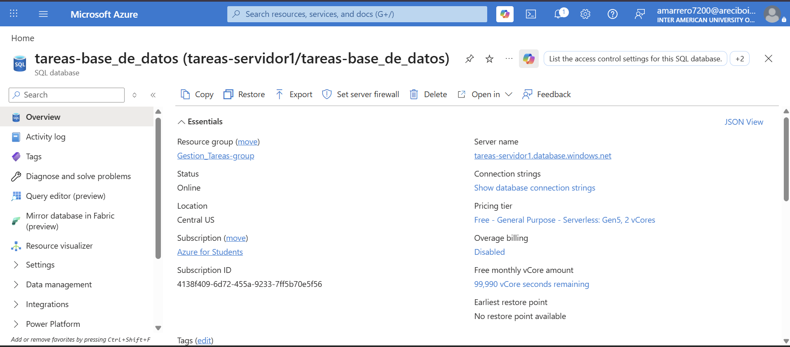
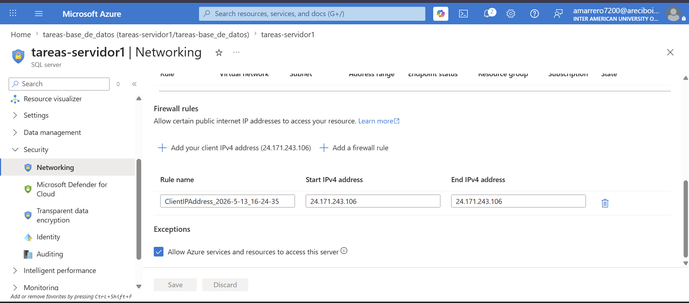

# Proyecto: Gestionador de Tareas 

---

## 🧑‍💻 Integrantes del Equipo
- Benyahir Y. Martínez Hermina - R00624824 - bmartinez4824@arecibointer.edu
- Adriana M. Marrero Sánchez - R00627200 - amarrero7200@arecibointer.edu

---

## 🎯 Descripción General
Describe brevemente tu aplicación:
- ¿Qué hace?
>La aplicación permite que el usuario pueda agregar una o varias tareas en una lista. En donde este puede marcar las tareas que este haya realizado y eliminar las tareas de la lista para seguir añadiendo tareas para evitar la confusión de lo que se haya realizado.
- ¿A quién va dirigida?
>Esta dirigida hacia estudiantes y empleados que quieren tenere un mejor control sobre lo que tienen que realizar en el momento o lo que tiene que hacer despues.
- ¿Qué problema resuelve o qué funcionalidad ofrece?
>Responde a la necesidad de personas de tener un lugar donde puedan mantenerse en día de las cosas que tienen que realizar tras el transcurso del día. Por ejemplo si un usuario en su trabajo le es otorgado con labores que tiene que realizar en es día, el usuario puede anotar estas en la aplicación para tener un mejor visualización de lo que tiene que hacer y mejor control en como tiene que hacerlo.

---

## ☁️ Servicios de Azure Utilizados

| Servicio              | Propósito dentro del proyecto                    | Gratuito en Azure for Students |
|-----------------------|--------------------------------------------------|--------------------------------|
| Azure App Service     | Donde se aloja nuestras aplicaciones web y también donde podemos controlar el funcionamiento de esta  | ✅ Sí                           |
| Azure SQL Database    | Recurso donde se estará almacenando los datos del sistema de las aplicaciones. | ✅ Sí                           |
| Azure Storage Account | Lugar donde se almacena archivos cargados por los usuarios de las aplicaciones. | ✅ Sí                           |
| Flask                 | Funciona como un servidor web que gestiona rutas de HTTP, renderizado las plantillas de HTML del proyecto. | ✅ Sí                      |
| Boostrap              | Se implemento para añadir a la aplicación una interfaz grafica mas amigable a los usuarios que utilizan la aplicación.   | ✅ Sí            |
| Repositorio de Github | Donde se localiza el código de nuestras aplicaciones web. En base a estar ese código en el repositorio Azure App Service coje ese código y realiza el despliegue en la nube.       | ✅ Sí       |

---

## 🧱 Diagrama de Arquitectura

---

## ⚙️ Despliegue y Configuración
  
### 1. Configuración en Azure
- Se creo una Base de datos en Microsoft Azure
- Se le establecio a esa base de datos reglas de firewall con el IP del cliente actual
- Se establecio el App Service en Azure para almacenar los archivos cargados por los usuarios.
- Donde se definieron las variables de entorno para entrelazar el app con la base de datos
- Tabmbien se creo un Storage Account en Azure para 

---

## 💻 Enlace a la Aplicación Desplegada
> [https://gestionadordetareas.azurewebsites.net](https://gestionadordetareas.azurewebsites.net) - Benyahir Y. Martinez Hermina

> [https://gestionador-de-tareas.azurewebsites.net](https://gestionador-de-tareas.azurewebsites.net) - Adriana M. Marrero Sánchez
---

## 💸 Estimación del Costo (Azure Pricing Calculator)

> 
> 
> 
> 

---

## 📁 Capturas del Portal de Azure
- Microsoft Azure SQL Database:
  >
  >
  >
  >
  >
  >
  ---
  >
  >
  >
  >
  >
  >

- Microsoft Azure App Service:
  >
  >
  >
  >
  >
  >
  >
  >
  >
  >
  ---
  >
  >
  >
  >
  >
  >
  >
  >
  >
  >
  
- Microsoft Azure Storage Account:
  >
  >
  >
---
  >
  >

## 📘 Lecciones Aprendidas
- ¿Qué retos enfrentaron y cómo los resolvieron?
  >Se exihibieron problemas con la inicializacion de la applicación en Microsoft Azure App Service con el repositorio de GitHub. Otro problema
  que se exhibio fue en hacer que la applicacion corriera de manera local en nuestras computadoras.
  >Para resolver el problema de la inicialización de la aplicación, se tuvo que varios “refreshes” y “resets” a la aplicación en Microsoft
  Azure App para que al final se pueda presentar sin ningún problema. Pero lastimosamente el problema con correr la aplicación de manera local no se pudo resolver.

- ¿Qué aprendieron sobre trabajar con servicios cloud?
  >Aprendimos que estos toman una gran cantidad de esfuerzo para que funcionen de manera coherente con todos sus componentes. Fue un nuevo territorio cuando tuvimos que añadir las variables del entorno al App Service sin tener en cuenta como funcionaban, pero cuando inspeccionamos la relación que tenían adentro del código de la aplicación pudimos entender como se relacionaban dándonos un mejor entendimiento de como iba a funcionar ya cuando todo se entrelazara. También al trabajar el proyecto de manera sudo cooperativa pudimos desarrollar nuestras habilidades en este campo de una manera mucho exponencial.
  
- ¿Qué mejorarían en una próxima versión del proyecto?
  >Consideraríamos para una versión nueva de este proyecto seria añadirle retroalimentación positiva al usuario que lo motive a seguir realizando sus tareas gestionadas. Al igual, que permitir que el usuario marque que tareas tiene prioridad y su fecha de limite. También que el usuario pueda crear grupos donde puede guardar tareas para poder organizarlas mejor.
  
---

## 📚 Repositorio del Código
Incluye el link al repositorio de GitHub (debe estar público o accesible para el profesor):
> [https://github.com/BenyahirMartinez2004/Comp4260-Projecto-Gestionador-de-Tareas.git](https://github.com/BenyahirMartinez2004/Comp4260-Projecto-Gestionador-de-Tareas.git) - Benyahir Y. Martínez Hermina
>
> [https://github.com/AdrianaM2S/Comp4260-Projecto-Gestionador-de-Tareas.git](https://github.com/AdrianaM2S/Comp4260-Projecto-Gestionador-de-Tareas.git) - Adriana M. Marrero Sánchez
---

## 📄 Instrucciones para Reproducir el Proyecto
1. Clonar el repositorio.
2. Crear una base de datos en Microsoft Azure
3. Crear un Storage Account en Azure
4. Crear un App Service en Azure
5. Conectar el App Service con un Repositorio de Github
6. En ese repositorio se colocara el contenido del repositorio clonado 
7. Activar/Inicializar el despliegue en Azure App Service

---

## ✅ Checklist Final
- [ ] App funcional y desplegada
- [ ] Servicios gratuitos utilizados correctamente
- [ ] Diagrama de arquitectura incluido
- [ ] Documentación clara y completa
- [ ] Costos estimados incluidos
- [ ] Repositorio disponible en GitHub
- [ ] Lecciones aprendidas y reflexión final escritas

---

